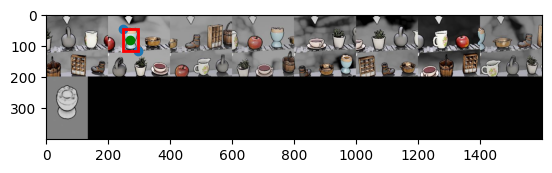

# Описание

[Полный ход исследование доступно здесь.](eda/SolvedV3-TensorFlow.ipynb)

> Обучение модели было произведено на *GPU NVIDIA GeForce RTX 3060 Ti 8192MiB*

# Решение



## Измерить точность предобученных моделей

- Из базового фото вырезаем искомый оригинал.
- На каждом фрагменте конвейера вырезаем предложенную фигуру.
- Вычисляем ембеддинги картинок и оригинал.
- Наиболее ближайший вектор к оригинальному - *target*.


> Точность предобученных моделей на текущей задаче низкая, поэтому выберем наилучшую и научим *оригиналы* сопоставлять с *target*.

## Файнтюнинг лучшей предобученной сети

1. Зафиксируем веса базовой модели.
2. Добавим в конец линейный слой.
3. Построим `Сиамскую сеть` со слоем расчета `Евклидового расстояния`. 


4. При обучении будем минимизировать расстояние `Кульбака-Лейблера` между исходными и целевыми изображениями.


## Искомая координата

- Обученный инкодер находит номер картинки.
- По номеру для любой картинки находим координаты.


# Итог

## Оценка моделей

Была рассчитана точность для 17 базовых моделей из библиотеки **Keras**:

1. ConvNeXtTiny `19.51%`
2. DenseNet121  `25.06%`
3. EfficientNetB0 `16.23%`
4. EfficientNetV2B0 `17.31%`
5. InceptionResNetV2 `16.43%`
6. InceptionV3 `23.61%`
7. MobileNet `24.06%`
8. MobileNetV2 `22.16%`
9. MobileNetV3Small `16.93%`
10. NASNetMobile `27.44%`
11. RegNetX002 `18.08%`
12. RegNetY002 `16.91%`
13. ResNet50 `27.56%`
14. ResNet50V2 `24.41%`
15. ResNetRS50 `12.51%`
16. VGG16 `13.08%`
17. Xception `28.76%`

В общем зачете победила сеть **Xception**.


В скрытом пространстве нет сильной консолидации оригинальных изображений в отдельный кластер, т.е. модель больше походит для этой задачи и проще обучать.

## Дообучение 

Дообучение *Xception* проходило до автоматической остановки:
- если скорость обучения будет ниже `1e-7`;
- ошибка на проверочной выборки перестала улучшаться;
- завершена `3000` эпоха.


В итоге обучение завершилось на `148` эпохе по сигналу переобучения.

Исходный датасет был разбит на `2048` по `32` батча - тренировочные данные, а остальные `1950` - проверочные и тестовые данные.


Общая точность составила на тренировочном наборе **98.36%**.

Видно, что вскрытом пространстве почти нет выбросов серо-оригинальных изображений.  


# Приложение

## Зависимости

`pip install -r requirements.txt`

## Запуск

```
python app [path] [optional path]

Использовать:
            app [путь к изображению капчи] [путь: куда сохранить результат]
            app [путь с меткам датасета для оценки] [путь к датасету]

```

- Если `path` путь к капче - будут выведены координаты фигуры. Если еще указан `optional path`, то сохранено будет фото по указанному пути с красной точкой на фигуре.


- Если `path` директория, то будет произведена расчет точности модели на датасете. 

> В метках читается `json` и путь `imagePath` к картинке, и если он не абсолютный, то нужно указать `optional path` путь до картинок. 
